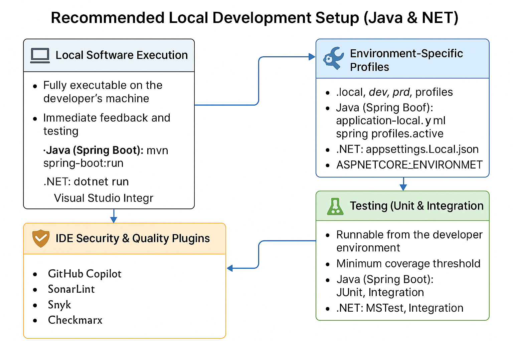

[BACK](README.md)

## Table of Contents

- [1. Improving Non-Modularized Projects](section1_projects.md)
- [2. Repository Naming](section2_repositories.md)
- [3. Architecture Proposals](section3_arquitecture.md)
- [4. Software Design Patterns Guide](section4_patterns.md)
- [5. Recommended Architecture for Large Projects (+20 Microservices)](section5_architecture_recommended.md)
- [6. Local Development Setup](section6_local_environment.md)
- [7. CI/CD Recommendation](section7_cicd.md)

 
 

## 6. 🖥️ Recommended Local Development Setup (Java & .NET)

To ensure quality, security, and environment consistency during the development cycle, it is recommended that all developers follow these practices for running and validating software locally.

---

### ✅ 6.1. Local Software Execution

Every application must be **fully executable on the developer’s machine**, without requiring access to production or external infrastructure. This guarantees:

- Immediate feedback and testing of new features.
- Easier debugging and validation.
- Autonomy for the development team.

> **Java (Spring Boot)**: Run via IDE, `mvn spring-boot:run`, or `docker-compose`.  
> **.NET**: Use `dotnet run` or launch from Visual Studio / Rider with environment-specific config.

---

### ✅ 6.22. Environment-Specific Profiles

Applications must support environment-based configuration profiles, such as:

| Profile | Purpose                          |
|---------|----------------------------------|
| `local` | Developer machine                |
| `dev`   | Shared development environment   |
| `prd`   | Production                       |

**Java (Spring Boot)**:
- Use `application-local.yml`, `application-dev.yml`, etc.
- Activate via `spring.profiles.active=local`.

**.NET**:
- Use `appsettings.Local.json`, `appsettings.Development.json`, etc.
- Activate with `ASPNETCORE_ENVIRONMENT=Local`.

This ensures correct use of:
- API endpoints per environment
- Credentials and secrets isolation
- Logging/debug modes

---

### ✅ 6.3. Testing (Unit & Integration)

All code must be backed by **unit tests and integration tests**, runnable from the developer environment:

| Requirement | Java (Spring Boot)         | .NET                             |
|-------------|-----------------------------|----------------------------------|
| Unit Tests  | JUnit, Mockito              | MSTest, xUnit, NUnit             |
| Integration | Spring Boot Test, TestContainers | TestServer, EF Core In-Memory DB |

- Tests must be runnable via `mvn test`, `gradle test` or `dotnet test`.
- Recommended to set **minimum test coverage threshold** using tools like Jacoco (Java) or Coverlet (C#).
- CI/CD pipelines must reject untested or broken code.

---

### ✅ 6.4. IDE Security & Quality Plugins

The following **IDE plugins/tools** must be enabled to identify issues early in the development phase:

| Tool        | Purpose                                                                 |
|-------------|-------------------------------------------------------------------------|
| **SonarLint / SonarQube** | Code quality, smells, complexity, maintainability           |
| **Security Bot**          | General alerts for vulnerabilities in code                  |
| **Black Duck**            | Open source license and vulnerability scanning              |
| **Snyk**                  | Dependency and code-level vulnerability detection           |
| **Checkmarx**             | Advanced static and dynamic security analysis (SAST/DAST)   |
| **Renovate**              | Automated dependency versioning and updates                 |

> These tools must be integrated with the local IDE (IntelliJ / VS Code / Visual Studio) and optionally the CI/CD pipelines for automated enforcement.

 
 

---

### 🧩 Additional Best Practices

- Include a `README.md` with local setup instructions.
- Use `docker-compose.yml` to standardize local environments (DBs, queues, services).
- Provide `.env.example` or sample configuration files.
- Simulate external services with mocks or stubs.
- Enable pre-commit checks for linting and test validation.
- Maintain unified logging standards per environment (e.g., console for local, file/syslog for prd).

---
 
 
 

[BACK](README.md)
