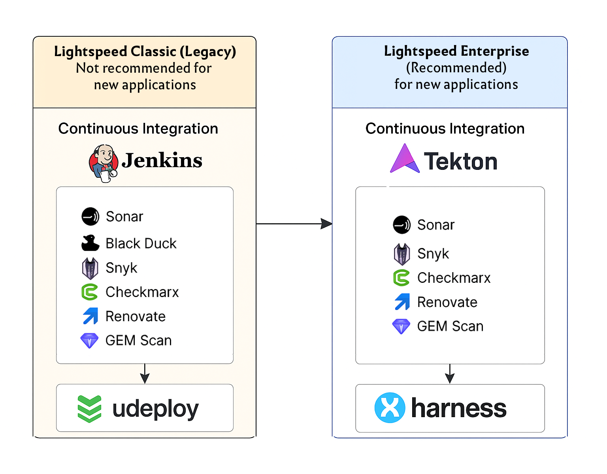

[BACK](README.md)

## Table of Contents

- [1. Improving Non-Modularized Projects](section1_projects.md)
- [2. Repository Naming](section2_repositories.md)
- [3. Architecture Proposals](section3_arquitecture.md)
- [4. Software Design Patterns Guide](section4_patterns.md)
- [5. Recommended Architecture for Large Projects (+20 Microservices)](section5_architecture_recommended.md)
- [6. Local Development Setup](section6_local_environment.md)
- [7. CI/CD Recommendation](section7_cicd.md)

 
 

## ✅ 7. CI/CD Recommendation for Software Projects

To ensure consistency, quality, and security across the software development lifecycle, the organization supports two CI/CD frameworks. These are designed to align with the company’s standards and infrastructure constraints.

---

 
 

## 7.1. 🚧 Lightspeed Classic (Legacy)

**Status:** *Supported but not recommended for new applications.*

This legacy CI/CD pipeline is maintained for compatibility with applications that require **deployment on Windows servers via Udeploy**.

### 7.1.1 Continuous Integration: Jenkins

Uses a Jenkins pipeline with the following mandatory security and quality plugins:

- ✅ **Sonar** – Static code analysis and quality gates  
- ✅ **Security Bot** – General vulnerability alerts  
- ✅ **Black Duck** – Open source dependency scanning  
- ✅ **Snyk** – Vulnerability scanning for code and libraries  
- ✅ **Checkmarx** – Static/dynamic security scanning (SAST/DAST)  
- ✅ **Renovate** – Automated dependency updates  
- ✅ **GEM Scan** – Internal company compliance checks  

### 7.1.2 Continuous Delivery: Udeploy

- Udeploy is used for application deployments, particularly in **Windows-based server environments**.
- Still used by legacy apps with infrastructure constraints.

> ⚠️ **Note:** Not recommended for modern applications or containerized microservices.

---

 
 

## 7.2. 🚀 Lightspeed Enterprise (Recommended)

**Status:** *✅ Officially recommended for all new applications.*

This modern pipeline enables robust, cloud-native CI/CD practices, especially suitable for microservices, containerized workloads, and Kubernetes-based deployments.

### 7.2.1 Continuous Integration: Tekton

A flexible, Kubernetes-native CI engine using Tekton pipelines, with enforced integration of:

- ✅ **Sonar**  
- ✅ **Security Bot**  
- ✅ **Snyk**  
- ✅ **Checkmarx**  
- ✅ **Renovate**  
- ✅ **GEM Scan**

These tools ensure that every code change is validated, scanned for vulnerabilities, and adheres to quality standards before progressing to delivery stages.

### 7.2.2 Continuous Delivery: Harness

Harness handles progressive delivery, with native support for:

- Canary or blue/green deployments  
- Rollback automation  
- Approval workflows  

> ✅ **Note:** Lightspeed Enterprise is the **default CI/CD path** for new application development across the organization.

---

 
 

## 📌 Final Recommendation

| Category              | Lightspeed Classic       | Lightspeed Enterprise        |
|-----------------------|--------------------------|-------------------------------|
| **CI Tool**           | Jenkins                  | Tekton                        |
| **CD Tool**           | Udeploy (Windows)        | Harness                       |
| **New Applications**  | ❌ Not recommended       | ✅ **Recommended**            |
| **Plugin Coverage**   | Full                     | Full                          |
| **Target Systems**    | Legacy / Windows Server  | Cloud-native / Kubernetes     |

---
 
 

---
 
 
 

[BACK](README_EN.md)
